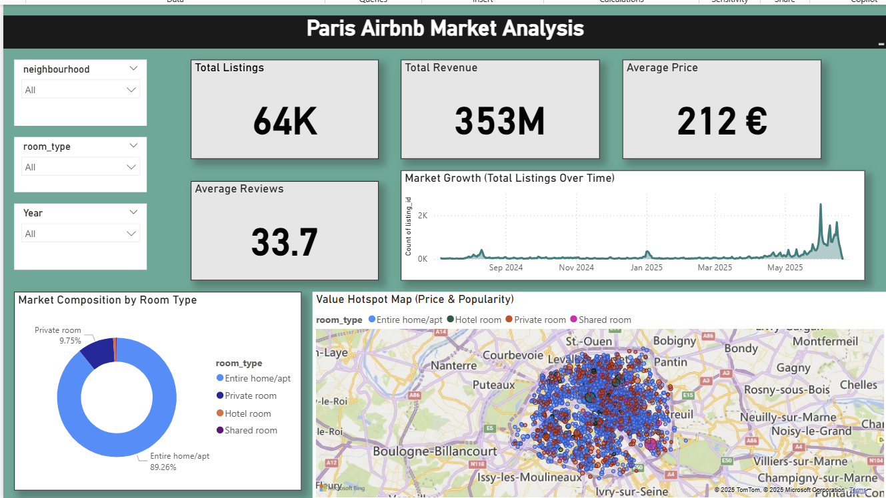

# Paris Airbnb Market Analysis Dashboard

## 📖 Project Summary

This project presents a comprehensive, multi-page Power BI dashboard designed to analyze the Airbnb market in Paris. The dashboard provides a 360-degree overview of the market, covering executive-level KPIs, deep dives into location-based intelligence, strategic pricing trends, and detailed host performance analysis. The goal is to equip users—from data analysts to potential hosts—with actionable insights to understand market dynamics, identify opportunities, and make data-driven decisions.

*(Screenshot of the Executive Summary page)*

---
## ✨ Key Features

* **Interactive & Dynamic:** Slicers on the main page sync across the entire report, allowing for seamless, cross-functional data exploration.
* **Multi-Page Analysis:** Four distinct pages guide the user from a high-level summary to granular details on specific business questions.
* **Calculated Metrics:** Utilizes DAX to create insightful calculated columns and measures, such as Estimated Revenue and Host Type, to enrich the analysis.
* **Advanced Visualizations:** Employs a variety of charts, including a heatmap calendar, a ribbon chart for ranking dynamics, and a scatter plot with quadrant analysis, to uncover complex patterns.
* **Professional Design:** Features a cohesive color theme, clear layout, and user-friendly navigation to ensure a polished and intuitive user experience.

---
## 📊 Dashboard Pages

The report is structured into four analytical pages:

### **1. Executive Summary**
A one-glance overview of the market's health and scale.
* **KPIs:** Total Listings, Total Revenue, Average Price, Average Reviews.
* **Visuals:** Donut chart for market composition, area chart for market growth over time, and a bubble map to visualize price and popularity hotspots.

### **2. Location Intelligence**
Compares Paris neighbourhoods to identify top performers and unique market characteristics.
* **Visuals:** Top 10 neighbourhoods by revenue, a 100% stacked bar chart showing room type specialization, a scatter plot for price vs. popularity quadrant analysis, and a performance scorecard matrix.

### **3. Strategic Pricing**
Analyzes pricing trends to uncover seasonality and optimal pricing strategies.
* **Visuals:** A dual-axis chart showing seasonality, a heatmap calendar for daily price optimization, a ribbon chart of competitive price rankings, and a bar chart quantifying the price premium by room type.

### **4. Host Analysis**
Focuses on the hosts themselves to identify top performers and analyze the relationship between host size and quality.
* **Visuals:** Top 10 "Power" hosts by listing count, an analysis of the economic impact of professional vs. single-listing hosts, and a scatter plot exploring the correlation between the number of host listings and average reviews.

---
## 🛠️ Technical Setup & Data

* **Tool:** Microsoft Power BI
* **Language:** DAX (Data Analysis Expressions)
* **Dataset:** The analysis is based on a cleaned dataset of Airbnb listings for Paris. Key columns include `listing_id`, `host_id`, `neighbourhood`, `room_type`, `price`, `minimum_nights`, `TotalReviews`, and `AvailabilityDays`.

### **Key DAX Measures Created:**
* **Estimated Revenue:** `price * minimum_nights * number_of_reviews_ltm`
* **Host Type:** `IF('Paris_Cleaned_final_DS'[HostTotalListings] > 1, "Professional Host", "Single Listing Host")`

---
## 🚀 How to Use

1.  Download the `.pbix` file.
2.  Open the file in Power BI Desktop.
3.  Use the slicers on the "Executive Summary" page to filter the entire report by **Neighbourhood**, **Room Type**, or **Year**.
4.  Navigate through the different pages to explore the detailed analyses.
